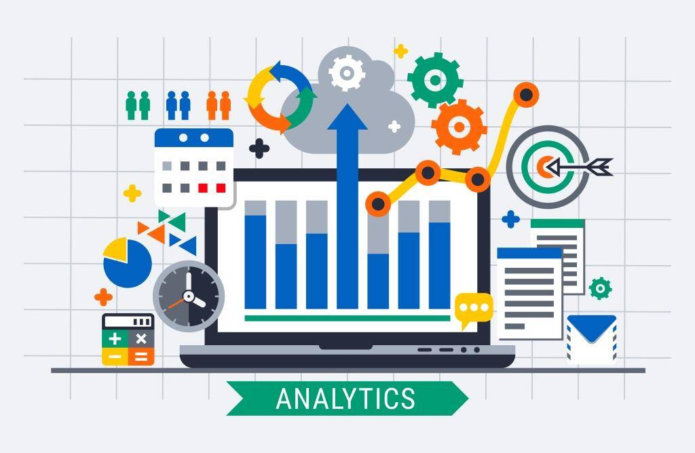

# 📊 My Data Analytics Journey 🚀  

Welcome to **Data Analytics Odyssey**, my personal learning journey into the world of data analytics. Here, I document my progress as I master essential tools, techniques, and concepts in Python for data analysis. This repository will serve as both a study guide and portfolio of hands-on projects. 🌱

---

## 📚 Topics Covered

### 🧮 1. NumPy  
- Arrays and vectorized operations  
- Indexing, slicing, reshaping  
- Broadcasting and performance tips

### 🐼 2. Pandas  
- DataFrames & Series  
- Data cleaning, filtering, and transformation  
- GroupBy, Merge, Join, and Pivot

### 📈 3. Matplotlib  
- Line plots, bar charts, scatter plots  
- Custom styling and subplots  
- Plot aesthetics and export

### 🧵 4. Seaborn  
- Statistical visualizations  
- Pair plots, heatmaps, and boxplots  
- Integration with Pandas

### 🕵️‍♂️ 5. Exploratory Data Analysis (EDA)  
- Data profiling  
- Univariate, bivariate, multivariate analysis  
- Outlier detection and distributions

### 🧹 6. Feature Engineering (FE)  
- Handling missing values  
- Encoding categorical variables  
- Scaling and transformation

### 📊 7. Statistics for Data Science  
- Descriptive & inferential statistics  
- Hypothesis testing  
- Correlation and probability

---

## 🛠️ Projects & Case Studies

| Project | Description | Tools |
|--------|-------------|-------|
| 💡 Titanic EDA | Analyze survival patterns | Pandas, Seaborn |
| 🛒 Sales Insights | Discover insights from sales data | Matplotlib, GroupBy |
| 🧠 Student Performance | Identify factors influencing grades | EDA, Stats, FE |

> More projects will be added as I progress through my journey. Stay tuned! 🔄

---

## 🌟 Why This Repository?

This repo is for:
- 📖 **Learning:** Step-by-step code, notes & visuals  
- 👨‍🏫 **Sharing:** Useful for beginners diving into data analytics  
- 📂 **Portfolio:** My curated work showcasing real-world application  

---

## 🧭 Navigation

- `notebooks/`: Jupyter Notebooks for each topic  
- `projects/`: End-to-end projects with documentation  
- `datasets/`: Sample datasets used for learning  
- `assets/`: Images and visualizations

---

## 📌 Connect With Me

- 🔗 [GitHub Profile](https://github.com/wasif-h) 
- 🌐 LinkedIn: wasif-h

---

## ⭐ Show Some Love

If you find this helpful, feel free to ⭐ the repo and follow me for more updates.  
Let’s learn and grow together in the world of data! 💪

---

